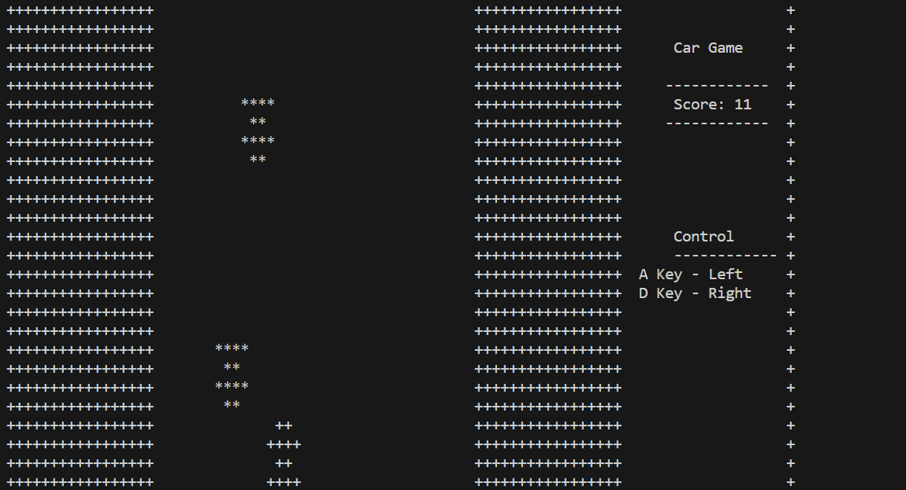

# ConsoleBased_CarGame2D_CppProject
This C++ program is a console-based car game that offers an entertaining gaming experience. In this game, players control a car within the console window, avoiding obstacles (represented by enemy cars) and aiming to achieve the highest score possible.

# Console-Based Car Game in C++

## Overview

This C++ program is a console-based car game that offers an entertaining gaming experience. In this game, players control a car within the console window, avoiding obstacles (represented by enemy cars) and aiming to achieve the highest score possible.

## Features

- **Interactive Gameplay:** The game provides an interactive experience where players can move their car left or right to avoid oncoming traffic.

- **Dynamic Obstacles:** Enemy cars move down the screen at varying speeds, creating a dynamic challenge for players.

- **Scoring System:** Players earn points as they successfully navigate through the traffic without colliding with enemy cars.

- **Customizable Cursor:** The game allows players to customize the visibility and size of the console cursor, enhancing the gaming experience.

## How to Play

- Use the 'a' key to move the car to the left.
- Use the 'd' key to move the car to the right.
- Press the 'Escape' key to exit the game.

## Menu Options

- Start Game: Begin the game and challenge your reflexes.
- Instructions: View game instructions to understand how to play.
- Quit: Exit the game.

## Installation and Usage

1. Clone the repository to your local machine
2. Compile the C++ code using your preferred compiler.
3. Run the executable file to start the game.

## License

This project is not licensed and falls under standard copyright law. There are no specific permissions granted for use, modification, or distribution beyond what is allowed by default copyright law.

## Acknowledgments

I would like to express my gratitude to the following individuals and resources who have been instrumental in the development of this project:

- **Angular's YouTube Channel:** I followed tutorials from Angular's YouTube channel. These tutorials provided valuable insights and guidance.

- **Geeks for Geeks:** The Geeks for Geeks website served as a valuable reference for algorithms, data structures, and programming concepts. Their well-explained articles helped me understand complex topics.

- **ChatGPT by OpenAI:** ChatGPT, an AI model by OpenAI, played a crucial role in answering my questions and clarifying doubts related to various programming and technical concepts. It was a valuable resource for getting quick and accurate information.

I'm deeply thankful to the creators and maintainers of these resources for their contributions to the developer community.

Please note that the use of these resources was for educational and reference purposes, and any code or content derived from them has been used respectfully and in compliance with their terms and conditions.

## Authors

- SIVARAGHAVI U.R.    (Insta id- @coders_kernel)

## Project Status

This project is actively maintained and open to contributions.

## Roadmap

This roadmap outlines the planned features and improvements for our console-based car game. I am committed to enhancing the gaming experience and making the game more engaging for our players. Please note that this roadmap is subject to change based on community feedback and evolving project goals.

## Phase 1: Redesign and Code Refactoring

- **UI and Design Enhancements**:
  - Redesign the game interface with improved graphics and animations.
  - Create more visually appealing car designs and obstacles.
  - Implement smoother transitions and better user feedback.

- **Code Refactoring**:
  - Review and refactor the existing codebase to improve code quality and maintainability.
  - Consider organizing code into well-structured classes and modules for easier expansion.

- **Sound Effects and Music**:
  - Add sound effects for actions like car movement, collision, and scoring.
  - Consider including background music to enhance the gaming experience.

## Phase 2: Multiplayer Integration

- **Networking**:
  - Implement a network layer to handle multiplayer functionality.
  - Decide on the multiplayer model (e.g., real-time, turn-based) and communication protocol.

- **Multiplayer Modes**:
  - Create different multiplayer game modes, such as competitive races or cooperative gameplay.

- **User Authentication**:
  - Add user authentication and player profiles.
  - Allow players to create accounts and log in to track their multiplayer progress.

## Phase 3: Score and Leaderboard Enhancements

- **Score Tracking**:
  - Enhance the scoring system to consider factors like time, distance, and performance.
  - Implement a combo system to reward consecutive successful maneuvers.

- **Leaderboards**:
  - Create online leaderboards to display top scores and rankings.
  - Allow players to compete for high scores against others globally.

- **Achievements**:
  - Add achievement badges or trophies to motivate players to achieve specific milestones.

## Phase 4: Testing and Optimization

- **Game Testing**:
  - Conduct thorough testing to identify and fix bugs.
  - Get feedback from beta testers to improve gameplay and user experience.

- **Performance Optimization**:
  - Optimize code and assets for smoother gameplay.
  - Ensure the game runs smoothly on a variety of devices and screen sizes.

## Phase 5: Documentation and Release

- **Documentation**:
  - Update the README and project documentation to reflect new features and changes.
  - Provide clear instructions on how to play the multiplayer version of the game.

- **Release Planning**:
  - Plan a release strategy for the multiplayer version.
  - Consider releasing on multiple platforms if applicable (e.g., desktop, mobile).

## Phase 6: Marketing and Community Engagement

- **Promotion**:
  - Promote the game through social media, forums, and game-related websites.
  - Collaborate with gaming communities and influencers to create awareness.

- **Community Engagement**:
  - Establish a community forum or chat channel for players to interact.
  - Encourage user-generated content, such as custom car designs or levels.

## Phase 7: Continuous Improvement

- **Feedback Loop**:
  - Continue to gather player feedback and iterate on the game.
  - Release updates and patches to address issues and introduce new content.

This roadmap reflects our commitment to delivering an exciting and engaging gaming experience to our players. I appreciate your support and look forward to your feedback and contributions as we work towards these exciting milestones.

   

